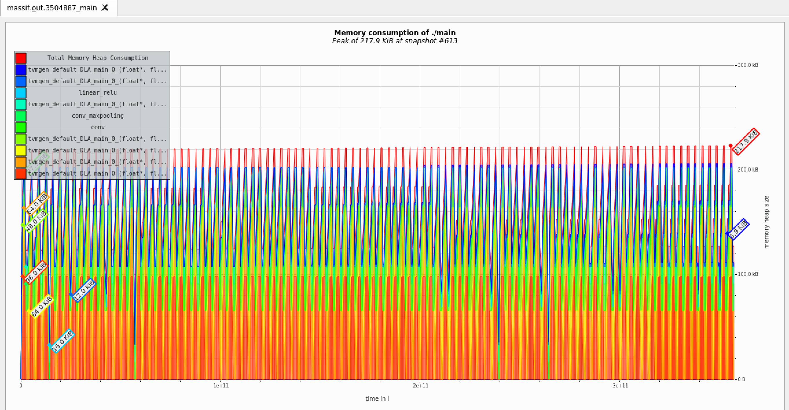

# Lab 5


## Getting started

In this lab, we will reuse the models implemented in Lab 1, which are imported as a submodule `lib`. To get started, clone the repository and initialize the submodule:

```shell
git clone ssh://git@aislab.ee.ncku.edu.tw:3175/aislab-internal/course/aoc/aoc2025/lab5.git
cd lab5
```

## Relay model to C code
1. To use code generator, in lab5
```shell
make build_model
```
- This command will:
    1. load model from onnx format, convert to relay model.
    2. parse and fused the relay model, and dump relay model expresion to text file.(Used in visuTVM)
    3. Build the model in python script, including traverse composited model, C code generation, weight generation.
    4. Parse the CIFAR10 dataset, and convert to custom input binary file.
    5. extract the tar generate from TVM, and categorize them into different folders.

2. Use visuTVM to visualize the Relay model graph and compare graph before and after merge composite pass.
```shell
make vizuTVM
```

## Test and Demo
After C code is generated, intergate them to a runtime program.
### CPU version
For quickly demo and test of cpu version:
```shell
make test_cpu
```
you will got a single shot of inference of full model in cpu-only runtime api.
```shell
CC weight.o
CC input.o
CC utils.o
CC runtime_cpu.o
CC hardware_cpu.o
CXX main.o
CXX model.o
LD main
make[1]: Leaving directory '/home/aoc2025/n26130605/work/lab5/testbench/cpu'
/home/aoc2025/n26130605/work/lab5
Running program...
make[1]: Entering directory '/home/aoc2025/n26130605/work/lab5/testbench/cpu'
mkdir -p log
Run test
===============[ single test ]===============
Input file: ../../output/bin/input.bin
Weight file: ../../output/bin/weight.bin
Class index: 4
Image index: 9
=============================================
Image Test: 9/10 image class         deer


=============================================
[    airplane]   5.203%
[  automobile]   0.058%
[        bird]   0.621%
[         cat]   0.333%
[        deer]  20.578%
[         dog]   0.484%
[        frog]   0.058%
[       horse]  71.826%
[        ship]   0.090%
[       truck]   0.750%
=============================================
make[1]: Leaving directory '/home/aoc2025/n26130605/work/lab5/testbench/cpu'
```
For more config in compiling cpu-only version runtime, move into `testbench/cpu`, then use `make usage` for more details about configurations.
```
cd testbench/cpu
make usage
```
```
Usage: make [target]

Available targets:
  all                      - Build the project (default target)
  test     [CLASS][INDEX]  - Run the compiled executable with test input
  valgrind [CLASS][INDEX]  - Run Valgrind Massif to analyze memory usage
  test_full                - Run with 100 test input
  valgrind_full            - Run Valgrind Massifwith 100 test input
  clean                    - Remove all generated files

Environment Variables:
  CLASS=<num>   - Set class index for testing (default: 4)
  INDEX=<num>   - Set test index (default: 9)
```

Notice that it is needed to `make clean` before any new configuration applied.
- `make test` is the single shot of indecated image.
- `make test_full` will implement 100 images.
    ```
    ================[ full test ]================
    Input file: ../../output/bin/input.bin
    Weight file: ../../output/bin/weight.bin
    =============================================
    '.' is PASS,'<num>' is the wrong prediction


    =============================================
    [ 0 -        airplane]  . . 2 . . 9 . . . .
    [ 1 -      automobile]  . 9 9 . . . . . . .
    [ 2 -            bird]  . 3 . . . . . . . 5
    [ 3 -             cat]  . . . . . . . . . .
    [ 4 -            deer]  . . . . . 5 . . . 7
    [ 5 -             dog]  . . . . . . . . . 3
    [ 6 -            frog]  . . . . . . . . . 4
    [ 7 -           horse]  . . . . . 3 . . . 4
    [ 8 -            ship]  . . 6 . . . . . . .
    [ 9 -           truck]  . . . . . . . . . .

    Correct/Total: 87/100
    =============================================
    ```
### massif-visualizer
- `make valgrind` and `make valgrind_full` perform the same as test did, but they have more infomation about memory access in the runtime. It use **massif** tool to trace the memory usage, and store the info in `massif_out` folder.
- Use massif-visualizer to parse and analyze the runtime memory usage.

> Remenber the X11 forwaording if use remote connection.




### DLA version
In DLA version test and demo, use `make test_dla` at top directory will perform a single shot simulation on eyeriss ASIC.

- it will takes frew more seconeds to simulation.
```
Run test
=============================================
Input file: ../../output/bin/input.bin
Weight file: ../../output/bin/weight.bin
Class index: 4
Image index: 9
=============================================
Image Test: 9/10 image class         deer


=============================================
[    airplane]   5.203%
[  automobile]   0.058%
[        bird]   0.621%
[         cat]   0.333%
[        deer]  20.578%
[         dog]   0.484%
[        frog]   0.058%
[       horse]  71.826%
[        ship]   0.090%
[       truck]   0.750%
=============================================
```

Also, for more information and configuraion about DLA version compile and inference is in `testbench/dla`, use `make usage` to get details about them.
```
cd testbench/dla
make usage
```
```
Usage: make [target]

Available targets:
  all  [DEBUG=?][DLA_INFO=?][USE_VCD=?]      - Build the project (default target)
  test [CLASS=<num>][INDEX=<num>]            - Run the compiled executable with test input
  clean      - Remove all generated files
  nWave      - Launch nWave with logs

Environment Variables:
  DEBUG=1       - Enable debug mode
  DLA_INFO=1    - Enable DLA info logs
  USE_VCD=1     - Enable VCD dumping
  CLASS=<num>   - Set class index for testing (default: 4)
  INDEX=<num>   - Set test index (default: 9)
```

Notice that the DLA version did not support test_full, because the 100 images simulation will takes more than one hours, even run on better server.

### DLA runtime analysis
To enable this feature, set the environment variable DLA_INFO=1 before running make test. After the test completes, a CSV file will be generated containing statistics and parameters for each task assigned to the DLA.

## Clean Up
1. To remove output logs and executables in a specific module, run `make clean` inside `testbench/cpu` or `testbench/dla`.
2. To clean up everything, including generated code and testbench executables, run `make clean` in the root directory of the lab project.

## Apack
Run `apack homework` to package the lab into homework release zip
