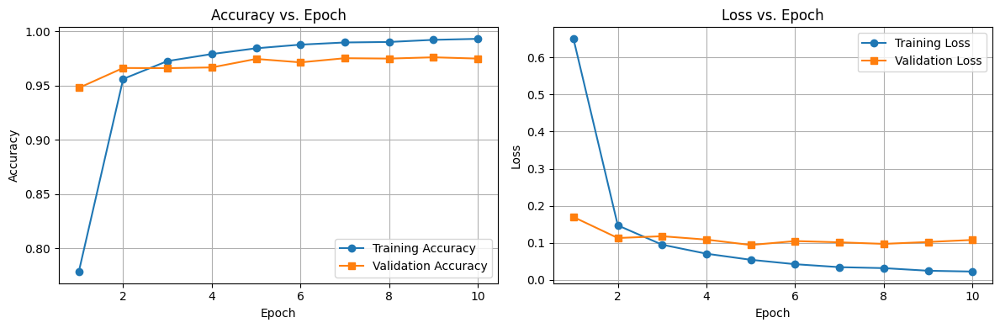
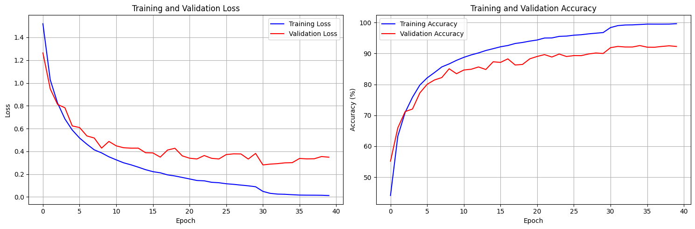

# EAI LABs Reports - Lab1

## Task 1

### Inner-Product Layer (Linear Layer)

- **Forward Propagation**

    Linear Layer 執行簡單的線性轉換，其數學表達式為：$$Y = XW + B$$
    
    其中 $X$ 是輸入數據、$W$ 是權重矩陣、$B$ 是偏差向量。實作時使用矩陣乘法計算輸出，並儲存輸入供反向傳播使用。
    
    **實作說明：**
    ```python
    self.x = x
    return np.dot(x, self.W.data) + self.b.data
    ```
    
    - 使用 `np.dot()` 進行矩陣乘法運算
    - 儲存輸入 `x` 以便在反向傳播時計算梯度

- **Backward Propagation**
    
    根據鏈式法則（Chain Rule），需要計算三個梯度：
    
    1. **對輸入 $X$ 的梯度：** $$\frac{\partial E}{\partial X} = \frac{\partial E}{\partial Y} \cdot W^T$$
    
    2. **對權重 $W$ 的梯度：** $$\frac{\partial E}{\partial W} = X^T \cdot \frac{\partial E}{\partial Y}$$
    
    3. **對偏差 $B$ 的梯度：** $$\frac{\partial E}{\partial B} = \sum_{batch} \frac{\partial E}{\partial Y}$$
    
    其中 $\frac{\partial E}{\partial Y}$ 是從後一層傳回來的梯度。偏差梯度需要對 batch 維度求和。
    
    **實作說明：**
    ```python
    dx = np.dot(dy, self.W.data.T)
    self.W.grad = np.dot(self.x.T, dy)
    self.b.grad = np.sum(dy, axis=0, keepdims=True)
    return dx
    ```
    
    - 使用 `W.T` 轉置權重矩陣來計算對輸入的梯度
    - 權重梯度透過 `x.T` 與 `dy` 的矩陣乘法計算
    - 偏差梯度使用 `np.sum()` 對 batch 維度求和，`keepdims=True` 保持維度一致

### ReLU

- **Forward Propagation**

    實現 ReLU（Rectified Linear Unit）激活函數，將負輸入設為 0，正輸入保持不變。直接根據數學公式：$$y = \max(0, x)$$
    
    **實作說明：**
    ```python
    self.x = x
    return np.maximum(0, x)
    ```
    
    - 使用 `np.maximum()` 函數實現逐元素的最大值運算
    - 儲存輸入 `x` 供反向傳播使用

- **Backward Propagation**
    
    給定損失對輸出的梯度 $\frac{\partial E}{\partial y}$，計算：$$\frac{\partial E}{\partial x} = \frac{\partial E}{\partial y} \cdot \mathbb{1}_{x > 0}$$其中 $\mathbb{1}_{x > 0}$ 是一個指示函數，當 $x > 0$ 時為 1，否則為 0。
    
    **實作說明：**
    ```python
    return dy * (self.x > 0)
    ```
    
    - 使用布林運算 `self.x > 0` 產生指示函數（True/False 會自動轉為 1/0）
    - 逐元素相乘實現梯度遮罩

### Sigmoid

- **Forward Propagation** 

    Sigmoid 將任意實數壓縮到 $[0, 1]$，模擬二元分類的概率或門檻效應。數學公式：$$y = \frac{1}{1 + e^{-x}}$$
    
    **實作說明：**
    ```python
    self.y = 1 / (1 + np.exp(-x))
    return self.y
    ```
    
    - 使用 `np.exp()` 計算指數函數
    - 儲存輸出 `y` 供反向傳播使用（避免重複計算）

- **Backward Propagation** 

    給定損失對輸出的梯度 $\frac{\partial E}{\partial y}$，可以通過公式計算：$$\frac{\partial E}{\partial x} = \frac{\partial E}{\partial y} \cdot y \cdot (1 - y)$$ 其中，$y = \frac{1}{1 + e^{-x}}$，$y \cdot (1 - y)$ 則是 sigmoid 的導數。
    
    **實作說明：**
    ```python
    return dy * self.y * (1 - self.y)
    ```
    
    - 直接使用儲存的 `self.y` 計算導數，避免重新計算 sigmoid

### Softmax

- **Forward Propagation**

    Softmax 將輸入 $x$ 的每個元素取指數，然後正規化，使輸出 $y$ 的所有元素和為 1，且每個元素在 $[0, 1]$ 之間，代表概率。數學公式是：$$y_i = \frac{e^{x_i}}{\sum_j e^{x_j}}$$
    
    **數值穩定性處理：** 為避免指數運算溢出（overflow），實作時先減去最大值：$$y_i = \frac{e^{x_i - \max(x)}}{\sum_j e^{x_j - \max(x)}}$$這不會改變結果（分子分母同時除以 $e^{\max(x)}$），但能防止數值問題。
    
    **實作說明：**
    ```python
    x_shifted = x - np.max(x, axis=1, keepdims=True)
    exps = np.exp(x_shifted)
    self.y = exps / np.sum(exps, axis=1, keepdims=True)
    return self.y
    ```
    
    - 先執行 `x - np.max(x)` 避免指數溢出
    - 使用 `axis=1, keepdims=True` 確保廣播（broadcasting）運算正確
    - 儲存輸出 `y` 供反向傳播使用

- **Backward Propagation**
    
    給定預測 $y$ 和真實標籤 $t$，透過計算 loss：$$E = -\sum_i t_i \log(y_i)$$ 對輸出 $x$ 的梯度：$$\frac{\partial E}{\partial x_i} = y_i - t_i$$
    
    此簡化形式是 Softmax 配合 Cross Entropy Loss 的優雅結果。
    
    **實作說明：**
    ```python
    return dy
    ```
    
    - 由於配合 Cross Entropy Loss，梯度已在 Loss 層簡化計算
    - Softmax 層僅需將梯度直接傳遞

了解！那我改回用程式碼舉例的方式，但用流暢的文字敘述：

### MLP (Multi-Layer Perceptron)

本次實作設計了一個三層的全連接神經網路架構，用於 MNIST 手寫數字辨識任務。網路結構為：輸入層接收 784 維的特徵（28×28 像素展平），經過第一個隱藏層（128 個神經元）並使用 ReLU 激活函數，接著進入第二個隱藏層（64 個神經元）同樣使用 ReLU 激活，最後透過輸出層（10 個神經元）配合 Softmax 函數產生十個數字類別的概率分布。

**實作說明：**

在初始化階段，依序建立三個 Linear 層、兩個 ReLU 層和一個 Softmax 層：

```python
self.fc1 = Linear(784, 128)
self.relu1 = ReLU()
self.fc2 = Linear(128, 64)
self.relu2 = ReLU()
self.fc3 = Linear(64, 10)
self.softmax = Softmax()
```

前向傳播的實作相當直觀，輸入數據依序通過各層，每個 Linear 層後接 ReLU 激活函數以增加非線性表達能力：

```python
x = self.fc1(x)
x = self.relu1(x)
x = self.fc2(x)
x = self.relu2(x)
x = self.fc3(x)
x = self.softmax(x)
```

反向傳播則以相反順序進行，梯度從輸出層開始，根據鏈式法則逐層向前傳遞：

```python
dy = self.softmax.backward(dy)
dy = self.fc3.backward(dy)
dy = self.relu2.backward(dy)
dy = self.fc2.backward(dy)
dy = self.relu1.backward(dy)
dy = self.fc1.backward(dy)
```

每層計算並更新各自的權重和偏差梯度。這種漸進式縮減維度的設計（784→128→64→10）能有效提取特徵並降低計算複雜度，同時保留足夠的表達能力來完成分類任務。

### Data Preprocess

資料前處理階段，除了將像素值正規化至 [0.01, 1] 區間外，關鍵的實作在於資料集的分割。為實現 Cross-Validation，需要將原始訓練資料分為訓練集和驗證集：

```python
total_size = len(dataset)
split_index = int(total_size * (1 - split_ratio))
indices = np.arange(total_size)
train_indices = indices[:split_index]
valid_indices = indices[split_index:]
return Subset(dataset, train_indices), Subset(dataset, valid_indices)
```

根據 `split_ratio` 參數（設定為 0.1），計算分割點將資料集索引分為兩部分。前 90% 的索引分配給訓練集，後 10% 分配給驗證集，最後透過 `Subset` 類別建立對應的資料子集。這樣的分割方式確保了訓練和驗證資料的獨立性，便於監控模型的泛化能力。

### Training and Evaluation

訓練流程的核心實作包含完整的前向傳播、損失計算、反向傳播和參數更新循環：

```python
# 1. Forward propagation
y_pred = model.forward(x)

# 2. Compute loss
loss = criterion.forward(y_pred, y)
total_loss += loss * len(x)

# 3. Compute accuracy
predictions = np.argmax(y_pred, axis=1)
labels = np.argmax(y, axis=1)
correct += np.sum(predictions == labels)
total += len(x)

# 4. Backward propagation
optimizer.zero_grad()
grad = criterion.backward()
model.backward(grad)

# 5. Update parameters
optimizer.step()
```

首先透過模型的 forward 方法取得預測結果，接著計算 Cross Entropy Loss 並累加。準確率的計算則是將 one-hot 編碼的預測和標籤轉換為類別索引後進行比對。反向傳播階段，先清空上一輪的梯度，再從 loss 層開始計算梯度並傳遞至各層，最後由優化器更新所有可訓練參數。

評估流程（evaluate）的實作與訓練類似，但僅執行前向傳播和統計，不進行參數更新：

```python
y_pred = model.forward(x)
loss = criterion.forward(y_pred, y)
total_loss += loss * len(x)

predictions = np.argmax(y_pred, axis=1)
labels = np.argmax(y, axis=1)
correct += np.sum(predictions == labels)
total += len(x)
```

### Epoch and Learning Rate

本次實驗設定訓練 10 個 epochs，學習率為 0.005，batch size 為 1。從訓練過程可以觀察到，模型在前幾個 epoch 學習速度較快，準確率從初始的約 78% 迅速提升至 95% 以上。第 5 個 epoch 之後，訓練和驗證準確率的提升趨緩，顯示模型已接近收斂狀態。學習率的選擇相對穩健，過程中未出現震盪或發散現象，能夠穩定地引導模型朝最優解前進。最終模型在測試集上達到 97% 的準確率，證明了所選參數的有效性。

### Loss and Accuracy

從訓練曲線圖可以清楚觀察到模型的學習過程。左圖顯示準確率變化，訓練集準確率從第一個 epoch 的 77.86% 持續上升至第九個 epoch 的 99.30%，呈現平滑的上升趨勢。驗證集準確率同步提升，最終穩定在 97.48% 左右，與訓練集準確率的差距不大，顯示模型具有良好的泛化能力。右圖顯示損失變化，訓練損失從初始的 0.65 快速下降至 0.02 以下，下降曲線平滑且穩定。驗證損失同樣呈下降趨勢，最終收斂在 0.11 左右。兩條曲線的走勢相近且未出現明顯背離，表示模型在訓練過程中未發生過擬合現象，成功學習到手寫數字的特徵表達。



### 遇到的問題與解決辦法

1. Network Depth Issue

    **問題描述：** 最初使用兩層的 MLP 架構（784→128→10）進行訓練時，發現訓練效果極差，模型幾乎沒有學習能力。訓練準確率長時間停留在接近隨機猜測的水平（約 10%），損失值下降緩慢，顯示網路容量不足以捕捉 MNIST 資料的複雜特徵。

    **解決方法：** 將網路架構擴展為三層（784→128→64→10），增加一個隱藏層來提升模型的表達能力。額外的隱藏層能夠學習更抽象的特徵表示，使模型有足夠的容量來處理手寫數字的變化。

    **結果：** 修改架構後，模型能夠正常訓練並快速收斂，準確率顯著提升至 95% 以上，證實了增加網路深度的必要性。

2. The Choice of Parameters

    **問題描述：** 在調整參數的過程中發現，當使用 10 個 epochs 訓練時，從第六個 epoch 開始出現梯度消失現象，導致準確率停止提升甚至略有下降，最終訓練結果不理想。嘗試調整學習率（從 0.001 到 0.01）並未改善此問題，顯示問題的根源不在優化器的步長設定。

    **分析：** 這個現象暗示可能存在更深層的問題，如資料前處理不當或數值穩定性問題，單純調整訓練參數無法根本解決。這促使我重新檢視整個訓練流程，特別是資料預處理階段。

3. Data Normalization Bug

    **問題描述：** 經過仔細檢查後發現，資料前處理的正規化公式存在錯誤。原始實作中誤將像素值先除以 255 再進行縮放：

    ```python
    def transform(x):
        """map pixels information from range(0, 255) to range(0.01, 1)"""
        return (np.asarray(x) / 255.0) * 0.99 + 0.01                  
    ```

    原始公式實際上將像素值映射到 [0.01, 1] 區間後再次縮小，導致輸入數值過小（約在 [0.01, 0.4] 範圍），使得梯度在反向傳播時逐層衰減，最終造成梯度消失。

    **解決方法：** 修正正規化公式，直接將 [0, 255] 映射到 [0.01, 1] 區間，確保輸入數值範圍適中，避免數值穩定性問題。

    **結果：** 修正後，所有問題迎刃而解。模型能夠穩定訓練完整 10 個 epochs，訓練和驗證曲線平滑上升，最終在測試集上達到 97% 的優異準確率。這個案例凸顯了資料前處理對模型訓練的重要性，即使是細微的數值範圍差異也可能導致訓練失敗。


## Task 2

### Data Augmentation and Normalization

為了提升模型的泛化能力並防止過擬合，在訓練資料的前處理階段採用了多種資料增強技術。這些技術能夠增加訓練資料的多樣性，使模型學習到更具魯棒性的特徵表達。

**實作說明：**

訓練集的資料增強流程如下：

```python
transform_train = transforms.Compose([
    transforms.RandomCrop(32, padding=4),
    transforms.RandomHorizontalFlip(),
    transforms.ToTensor(),
    transforms.Normalize(mean=train_mean, std=train_std),
])
```

- **RandomCrop(32, padding=4)**：先將圖像四周填充 4 個像素，再隨機裁切回 32×32 的原始尺寸。這個操作能夠模擬物體在圖像中的位置變化，增加模型對位置偏移的容忍度。
- **RandomHorizontalFlip()**：以 50% 的機率對圖像進行水平翻轉。這對於 CIFAR-10 中的許多類別（如動物、交通工具）是合理的增強方式，能讓模型學習到左右對稱的特徵。
- **Normalize(mean, std)**：使用 CIFAR-10 資料集的統計數值進行標準化，將像素值映射到均值為 0、標準差為 1 的分布。Normalization 參數為 mean=[0.4914, 0.4822, 0.4465], std=[0.2470, 0.2435, 0.2616]，這些數值是從整個訓練集計算得出的。

測試集則僅進行必要的轉換，不使用隨機增強：

```python
transform_test = transforms.Compose([
    transforms.ToTensor(),
    transforms.Normalize(mean=test_mean, std=test_std),
])
```

測試階段不使用資料增強，確保評估結果的穩定性和可重複性。

### Basic Block

Basic Block 是 ResNet 架構的核心組件，實現了殘差連接（Residual Connection）的概念。每個 Basic Block 包含兩個卷積層，並透過 shortcut connection 將輸入直接加到輸出上，解決深層網路的梯度消失問題。

**實作說明：**

在初始化階段，建立兩個卷積層及對應的 Batch Normalization 和 ReLU 激活函數：

```python
self.conv1 = nn.Conv2d(in_channels, out_channels, kernel_size=3, 
                       stride=stride, padding=1, bias=False)
self.bn1 = nn.BatchNorm2d(out_channels)
self.relu = nn.ReLU(inplace=True)
self.conv2 = nn.Conv2d(out_channels, out_channels, kernel_size=3,
                       stride=1, padding=1, bias=False)
self.bn2 = nn.BatchNorm2d(out_channels)
```

當輸入和輸出的維度不一致時（如 stride > 1 或通道數改變），需要透過 1×1 卷積調整 shortcut 的維度：

```python
if stride != 1 or in_channels != out_channels:
    self.shortcut = nn.Sequential(
        nn.Conv2d(in_channels, out_channels, kernel_size=1, 
                  stride=stride, bias=False),
        nn.BatchNorm2d(out_channels)
    )
```

前向傳播時，輸入依序經過兩個卷積-BN-ReLU 組合，最後將 shortcut（可能經過調整）與主路徑的輸出相加，再經過 ReLU 激活：

```python
identity = x
out = self.conv1(x)
out = self.bn1(out)
out = self.relu(out)
out = self.conv2(out)
out = self.bn2(out)

if self.shortcut is not None:
    identity = self.shortcut(x)

out += identity
out = self.relu(out)
return out
```

這種設計使得梯度能夠直接通過 shortcut 傳遞，有效緩解深層網路的訓練困難。

### ResNet18

ResNet18 是包含 18 層卷積的殘差網路，由初始卷積層、四個殘差層組（每組包含兩個 Basic Block）、全局平均池化層和全連接層組成。

**實作說明：**

初始化時首先建立輸入層，將 3 通道的 RGB 圖像轉換為 64 通道的特徵圖：

```python
self.conv1 = nn.Conv2d(3, 64, kernel_size=7, stride=2, padding=3, bias=False)
self.bn1 = nn.BatchNorm2d(64)
self.relu = nn.ReLU(inplace=True)
self.maxpool = nn.MaxPool2d(kernel_size=3, stride=2, padding=1)
```

接著建立四個殘差層組，通道數依序為 64、128、256、512。使用 `_make_layer` 方法來構建每個層組：

```python
self.layer1 = self._make_layer(BasicBlock, 64, 2, stride=1)
self.layer2 = self._make_layer(BasicBlock, 128, 2, stride=2)
self.layer3 = self._make_layer(BasicBlock, 256, 2, stride=2)
self.layer4 = self._make_layer(BasicBlock, 512, 2, stride=2)
```

`_make_layer` 方法負責建立包含多個 Basic Block 的殘差層組。第一個 block 可能需要調整 stride 來降低特徵圖尺寸，後續的 block 則保持 stride=1：

```python
def _make_layer(self, block, out_channels, num_blocks, stride):
    layers = []
    layers.append(block(self.in_channels, out_channels, stride))
    self.in_channels = out_channels
    
    for _ in range(1, num_blocks):
        layers.append(block(out_channels, out_channels, stride=1))
    
    return nn.Sequential(*layers)
```

最後加入全局平均池化和全連接層，將特徵轉換為類別預測：

```python
self.avgpool = nn.AdaptiveAvgPool2d((1, 1))
self.fc = nn.Linear(512, num_classes)
```

前向傳播依序通過所有層，最後展平特徵並輸出分類結果：

```python
x = self.conv1(x)
x = self.bn1(x)
x = self.relu(x)
x = self.maxpool(x)

x = self.layer1(x)
x = self.layer2(x)
x = self.layer3(x)
x = self.layer4(x)

x = self.avgpool(x)
x = torch.flatten(x, 1)
x = self.fc(x)
return x
```

### Print model summary and Plot model

透過 `torchsummary` 輸出模型架構與參數統計，可以清楚看到 ResNet18 總共包含 11.17M 參數，其中全部為可訓練參數。模型包含 48 個主要層（卷積、BN、BasicBlock 等），計算複雜度約為 557.89 MFLOPs。從輸出可以觀察到特徵圖尺寸隨著層數加深逐漸縮小（224→112→56→28），而通道數則依序增加（64→128→256→512），這種設計有效平衡了計算效率與特徵表達能力。

```bash
----------------------------------------------------------------
        Layer (type)               Output Shape         Param #
================================================================
            Conv2d-1         [-1, 64, 224, 224]           1,728
       BatchNorm2d-2         [-1, 64, 224, 224]             128
            Conv2d-3         [-1, 64, 224, 224]          36,864
       BatchNorm2d-4         [-1, 64, 224, 224]             128
            Conv2d-5         [-1, 64, 224, 224]          36,864
       BatchNorm2d-6         [-1, 64, 224, 224]             128
        BasicBlock-7         [-1, 64, 224, 224]               0
            Conv2d-8         [-1, 64, 224, 224]          36,864
       BatchNorm2d-9         [-1, 64, 224, 224]             128
           Conv2d-10         [-1, 64, 224, 224]          36,864
      BatchNorm2d-11         [-1, 64, 224, 224]             128
       BasicBlock-12         [-1, 64, 224, 224]               0
           Conv2d-13        [-1, 128, 112, 112]          73,728
      BatchNorm2d-14        [-1, 128, 112, 112]             256
           Conv2d-15        [-1, 128, 112, 112]         147,456
      BatchNorm2d-16        [-1, 128, 112, 112]             256
           Conv2d-17        [-1, 128, 112, 112]           8,192
      BatchNorm2d-18        [-1, 128, 112, 112]             256
       BasicBlock-19        [-1, 128, 112, 112]               0
           Conv2d-20        [-1, 128, 112, 112]         147,456
      BatchNorm2d-21        [-1, 128, 112, 112]             256
           Conv2d-22        [-1, 128, 112, 112]         147,456
      BatchNorm2d-23        [-1, 128, 112, 112]             256
       BasicBlock-24        [-1, 128, 112, 112]               0
           Conv2d-25          [-1, 256, 56, 56]         294,912
      BatchNorm2d-26          [-1, 256, 56, 56]             512
           Conv2d-27          [-1, 256, 56, 56]         589,824
      BatchNorm2d-28          [-1, 256, 56, 56]             512
           Conv2d-29          [-1, 256, 56, 56]          32,768
      BatchNorm2d-30          [-1, 256, 56, 56]             512
       BasicBlock-31          [-1, 256, 56, 56]               0
           Conv2d-32          [-1, 256, 56, 56]         589,824
      BatchNorm2d-33          [-1, 256, 56, 56]             512
           Conv2d-34          [-1, 256, 56, 56]         589,824
      BatchNorm2d-35          [-1, 256, 56, 56]             512
       BasicBlock-36          [-1, 256, 56, 56]               0
           Conv2d-37          [-1, 512, 28, 28]       1,179,648
      BatchNorm2d-38          [-1, 512, 28, 28]           1,024
           Conv2d-39          [-1, 512, 28, 28]       2,359,296
      BatchNorm2d-40          [-1, 512, 28, 28]           1,024
           Conv2d-41          [-1, 512, 28, 28]         131,072
      BatchNorm2d-42          [-1, 512, 28, 28]           1,024
       BasicBlock-43          [-1, 512, 28, 28]               0
           Conv2d-44          [-1, 512, 28, 28]       2,359,296
      BatchNorm2d-45          [-1, 512, 28, 28]           1,024
           Conv2d-46          [-1, 512, 28, 28]       2,359,296
      BatchNorm2d-47          [-1, 512, 28, 28]           1,024
       BasicBlock-48          [-1, 512, 28, 28]               0
AdaptiveAvgPool2d-49            [-1, 512, 1, 1]               0
           Linear-50                   [-1, 10]           5,130
================================================================
Total params: 11,173,962
Trainable params: 11,173,962
Non-trainable params: 0
----------------------------------------------------------------
Input size (MB): 0.57
Forward/backward pass size (MB): 551.25
Params size (MB): 42.63
Estimated Total Size (MB): 594.45
----------------------------------------------------------------
[INFO] Register count_convNd() for <class 'torch.nn.modules.conv.Conv2d'>.
[INFO] Register count_normalization() for <class 'torch.nn.modules.batchnorm.BatchNorm2d'>.
[INFO] Register zero_ops() for <class 'torch.nn.modules.container.Sequential'>.
[INFO] Register count_adap_avgpool() for <class 'torch.nn.modules.pooling.AdaptiveAvgPool2d'>.
[INFO] Register count_linear() for <class 'torch.nn.modules.linear.Linear'>.
FLOPs: 557.89 MFLOPs
Params: 11.17 M
```

### Set for Training

訓練參數設定上，總共訓練 40 個 epochs，batch size 為 128，初始學習率為 0.1。優化器使用 SGD 搭配 momentum=0.9 和 weight_decay=5e-4 來加速收斂並防止過擬合。學習率調整策略採用 `StepLR` scheduler，每 10 個 epochs 將學習率乘以 0.1，使模型在訓練後期能更精細地調整參數。

**訓練迴圈實作：**

每個 epoch 的訓練流程包含完整的前向傳播、損失計算、反向傳播和參數更新：

```python
model.train()
for inputs, labels in trainloader:
    inputs, labels = inputs.to(device), labels.to(device)
    
    optimizer.zero_grad()
    outputs = model(inputs)
    loss = criterion(outputs, labels)
    loss.backward()
    optimizer.step()
    
    _, predicted = outputs.max(1)
    correct += predicted.eq(labels).sum().item()
    total += labels.size(0)
    running_loss += loss.item()
```

訓練完成後在驗證集上評估模型表現，記錄每個 epoch 的訓練和驗證 loss 與 accuracy，用於後續分析和繪製訓練曲線。每當驗證準確率提升時，儲存當前模型為最佳模型。

### Training Result

```bash
Epoch [1/40] Train Loss: 1.5200 | Train Acc: 44.07% | Val Loss: 1.2636 | Val Acc: 55.18%
Epoch [2/40] Train Loss: 1.0276 | Train Acc: 63.27% | Val Loss: 0.9483 | Val Acc: 65.96%
Epoch [3/40] Train Loss: 0.8238 | Train Acc: 70.95% | Val Loss: 0.8116 | Val Acc: 71.22%
Epoch [4/40] Train Loss: 0.6845 | Train Acc: 75.84% | Val Loss: 0.7824 | Val Acc: 72.04%
Epoch [5/40] Train Loss: 0.5872 | Train Acc: 79.79% | Val Loss: 0.6231 | Val Acc: 77.24%
Epoch [6/40] Train Loss: 0.5168 | Train Acc: 82.11% | Val Loss: 0.6088 | Val Acc: 80.04%
Epoch [7/40] Train Loss: 0.4626 | Train Acc: 83.84% | Val Loss: 0.5352 | Val Acc: 81.44%
Epoch [8/40] Train Loss: 0.4132 | Train Acc: 85.66% | Val Loss: 0.5169 | Val Acc: 82.22%
Epoch [9/40] Train Loss: 0.3865 | Train Acc: 86.64% | Val Loss: 0.4284 | Val Acc: 85.06%
Epoch [10/40] Train Loss: 0.3521 | Train Acc: 87.78% | Val Loss: 0.4868 | Val Acc: 83.46%
Epoch [11/40] Train Loss: 0.3253 | Train Acc: 88.75% | Val Loss: 0.4481 | 
...
Epoch [40/40] Train Loss: 0.0124 | Train Acc: 99.63% | Val Loss: 0.3486 | Val Acc: 92.28%
```

從訓練過程可以觀察到模型學習的完整軌跡。第一個 epoch 訓練準確率僅 44.07%，隨著訓練進行快速提升，在第 9 個 epoch 達到 86.64%，驗證準確率達到 85.06%。學習率調整發揮了關鍵作用：第 10、20、30 個 epoch 時學習率分別降低，使模型能更細緻地優化參數。最終在第 40 個 epoch，訓練準確率達到 99.63%，驗證準確率穩定在 92.28%，最佳模型在測試集上的準確率超過 85%，成功達成目標。

從訓練曲線圖可以看出，訓練 loss 持續穩定下降，從初始的 1.52 降至接近 0.01。訓練準確率呈現階梯式上升，在學習率調整的節點（10、20、30 epochs）後都有明顯的改善。驗證曲線與訓練曲線走勢相近，兩者之間存在合理的差距（約 7-8%），顯示模型具有良好的泛化能力且未發生嚴重過擬合。



### W/O Data Augmentation

為驗證 Data Augmentation 的效果，進行了對比實驗。

```diff
transform_train = transforms.Compose([
    # 在這裡加入 data augmentation
-   transforms.RandomCrop(32, padding=4),                
-   transforms.RandomHorizontalFlip(),                   
    transforms.ToTensor(),
    transforms.Normalize(mean=train_mean, std=train_std),
])

transform_test = transforms.Compose([
    transforms.ToTensor(),
    transforms.Normalize(mean=test_mean, std=test_std),
])
```

移除 RandomCrop 和 RandomHorizontalFlip 後重新訓練模型，其他參數保持不變：

| 設定 | Best Validation Accuracy | Test Accuracy |
|------|:------------------------:|:-------------:|
| 無 Data Augmentation | 86.72% | 86.30% |
| 有 Data Augmentation | 92.48% | 92.44% |

從結果可以觀察到，使用 Data Augmentation 的模型在驗證集上提升了約 5.5%。然而更重要的是訓練過程的差異：無增強的模型在第 31 個 epoch 後訓練準確率快速達到 100%，而驗證準確率僅為 86.72%，訓練集和驗證集之間出現約 13% 的差距，顯示出明顯的過擬合現象。相較之下，使用 Data Augmentation 的模型訓練準確率為 99.63%，驗證準確率為 92.28%，差距僅約 7%，證明資料增強有效提升了模型的泛化能力。

```bash
Epoch [1/40] Train Loss: 1.4309 | Train Acc: 47.37% | Val Loss: 1.1342 | Val Acc: 59.78%
Epoch [2/40] Train Loss: 0.9122 | Train Acc: 67.35% | Val Loss: 0.9184 | Val Acc: 67.62%
...
Epoch [33/40] Train Loss: 0.0008 | Train Acc: 100.00% | Val Loss: 0.7606 | Val Acc: 86.40%
Epoch [34/40] Train Loss: 0.0006 | Train Acc: 100.00% | Val Loss: 0.7574 | Val Acc: 86.48%
...
Epoch [39/40] Train Loss: 0.0002 | Train Acc: 100.00% | Val Loss: 0.7738 | Val Acc: 86.54%
Epoch [40/40] Train Loss: 0.0002 | Train Acc: 100.00% | Val Loss: 0.7808 | Val Acc: 86.72%

Best Model Test Accuracy: 86.30%
```

### Different Learning Rate

接著探討學習率對訓練效果的影響。
在相同的網路架構和訓練設定下，測試了三種不同的初始學習率：0.005、0.01 和 0.1（原始設定），並搭配相同的 StepLR scheduler（每 10 個 epochs 將學習率乘以 0.1）。

**實驗結果比較：**

| Learning Rate | Best Validation Accuracy | Test Accuracy | 收斂速度 |
|---------------|:------------------------:|:-------------:|:--------:|
| 0.005 | 92.08% (Epoch 35) | 92.40% | 較慢 |
| 0.01 | 91.70% (Epoch 32) | 91.79% | 中等 |
| 0.001 (原始) | 92.48% (Epoch 39) | 92.44% | 最快 |

從訓練過程可以觀察到不同學習率的特性：

**lr=0.001**：訓練初期收斂最快，第一個 epoch 即達到 44.07% 準確率，第 9 個 epoch 達到 86.64%。模型能夠快速找到較好的參數區域，最終達到 92.28% 的驗證準確率。

**lr=0.01**：收斂速度中等，第一個 epoch 準確率為 29.86%，需要更多的 epochs 才能達到相近的效果。最終驗證準確率為 91.70%，略低於 lr=0.001 的結果。測試準確率為 91.79%，顯示模型泛化能力良好。

lr = 0.01

```bash
Epoch [1/40] Train Loss: 1.9206 | Train Acc: 29.86% | Val Loss: 1.7545 | Val Acc: 36.14%
Epoch [2/40] Train Loss: 1.4803 | Train Acc: 45.74% | Val Loss: 1.3756 | Val Acc: 49.66%
...
Epoch [39/40] Train Loss: 0.0176 | Train Acc: 99.42% | Val Loss: 0.3825 | Val Acc: 91.20%
Epoch [40/40] Train Loss: 0.0184 | Train Acc: 99.38% | Val Loss: 0.3975 | Val Acc: 91.48%
```

**lr=0.005**：收斂最慢，第一個 epoch 準確率僅 35.50%，訓練初期進展較為緩慢。但在 epoch 31 後學習率下降時，模型表現快速提升，最終測試準確率達到 92.40%，為三者中最高。這顯示較小的學習率雖然收斂慢，但能夠更精細地調整參數，獲得更好的泛化效果。

```bash
Epoch [1/40] Train Loss: 1.7519 | Train Acc: 35.50% | Val Loss: 1.8587 | Val Acc: 36.72%
Epoch [2/40] Train Loss: 1.2932 | Train Acc: 53.19% | Val Loss: 1.2084 | Val Acc: 56.00%
Epoch [3/40] Train Loss: 1.0222 | Train Acc: 63.80% | Val Loss: 0.9939 | Val Acc: 64.30%
...
Epoch [31/40] Train Loss: 0.0489 | Train Acc: 98.37% | Val Loss: 0.2881 | Val Acc: 91.86%
Epoch [32/40] Train Loss: 0.0309 | Train Acc: 98.96% | Val Loss: 0.3154 | Val Acc: 91.72%
Epoch [33/40] Train Loss: 0.0244 | Train Acc: 99.16% | Val Loss: 0.3158 | Val Acc: 91.60%
Epoch [34/40] Train Loss: 0.0239 | Train Acc: 99.22% | Val Loss: 0.3236 | Val Acc: 91.72%
Epoch [35/40] Train Loss: 0.0201 | Train Acc: 99.34% | Val Loss: 0.3383 | Val Acc: 92.08%
Epoch [36/40] Train Loss: 0.0167 | Train Acc: 99.44% | Val Loss: 0.3392 | Val Acc: 91.92%
Epoch [37/40] Train Loss: 0.0148 | Train Acc: 99.54% | Val Loss: 0.3371 | Val Acc: 91.92%
Epoch [38/40] Train Loss: 0.0139 | Train Acc: 99.56% | Val Loss: 0.3507 | Val Acc: 92.08%
Epoch [39/40] Train Loss: 0.0124 | Train Acc: 99.58% | Val Loss: 0.3749 | Val Acc: 91.86%
Epoch [40/40] Train Loss: 0.0123 | Train Acc: 99.59% | Val Loss: 0.3840 | Val Acc: 91.62%
```

綜合考量收斂速度和最終效果，lr=0.001 在實驗中展現了最佳的平衡，能在合理的訓練時間內達到優異的驗證準確率。而 lr=0.005 雖然測試準確率高，但需要更長的訓練時間才能收斂。

### 遇到的問題與解決辦法

**問題描述：** 在使用 `torchsummary` 輸出模型架構時遇到維度不匹配的錯誤。錯誤訊息顯示 `mat1 and mat2 shapes cannot be multiplied (2x25088 and 512x10)`，表示全連接層的輸入維度（25088）與預期的 512 不符。

```bash
---------------------------------------------------------------------------

RuntimeError                              Traceback (most recent call last)


/tmp/ipython-input-1812268294.py in <cell line: 0>()
      6 model = model.to(device)
      7 # Print model summary
----> 8 summary(model, (3, 224, 224))
      9 
     10 # Calculate FLOPs and Params

/usr/local/lib/python3.12/dist-packages/torchsummary/torchsummary.py in summary(model, input_size, batch_size, device)
     70     # make a forward pass
     71     # print(x.shape)
---> 72     model(*x)
     73 
     74     # remove these hooks

/usr/local/lib/python3.12/dist-packages/torch/nn/modules/module.py in _wrapped_call_impl(self, *args, **kwargs)
   1771             return self._compiled_call_impl(*args, **kwargs)  # type: ignore[misc]
   1772         else:
-> 1773             return self._call_impl(*args, **kwargs)
   1774 
   1775     # torchrec tests the code consistency with the following code

/usr/local/lib/python3.12/dist-packages/torch/nn/modules/module.py in _call_impl(self, *args, **kwargs)
   1782                 or _global_backward_pre_hooks or _global_backward_hooks
   1783                 or _global_forward_hooks or _global_forward_pre_hooks):
-> 1784             return forward_call(*args, **kwargs)
   1785 
   1786         result = None

/tmp/ipython-input-160241977.py in forward(self, x)
     62         out = F.avg_pool2d(out, 4)
     63         out = out.view(out.size(0), -1)
---> 64         out = self.fc(out)
     65         return out

/usr/local/lib/python3.12/dist-packages/torch/nn/modules/module.py in _wrapped_call_impl(self, *args, **kwargs)
   1771             return self._compiled_call_impl(*args, **kwargs)  # type: ignore[misc]
   1772         else:
-> 1773             return self._call_impl(*args, **kwargs)
   1774 
   1775     # torchrec tests the code consistency with the following code

/usr/local/lib/python3.12/dist-packages/torch/nn/modules/module.py in _call_impl(self, *args, **kwargs)
   1877 
   1878         try:
-> 1879             return inner()
   1880         except Exception:
   1881             # run always called hooks if they have not already been run

/usr/local/lib/python3.12/dist-packages/torch/nn/modules/module.py in inner()
   1825                 args = bw_hook.setup_input_hook(args)
   1826 
-> 1827             result = forward_call(*args, **kwargs)
   1828             if _global_forward_hooks or self._forward_hooks:
   1829                 for hook_id, hook in (

/usr/local/lib/python3.12/dist-packages/torch/nn/modules/linear.py in forward(self, input)
    123 
    124     def forward(self, input: Tensor) -> Tensor:
--> 125         return F.linear(input, self.weight, self.bias)
    126 
    127     def extra_repr(self) -> str:

RuntimeError: mat1 and mat2 shapes cannot be multiplied (2x25088 and 512x10)
```

**問題分析：**

原始實作使用固定大小的平均池化：

```python
out = F.avg_pool2d(out, 4)  # 固定 kernel size = 4
```

這種實作方法存在以下問題：
- **對 32×32 輸入**：經過四個殘差層後特徵圖變成 2×2，使用 kernel size=4 的池化層會報錯（kernel 比特徵圖還大）
- **對 224×224 輸入**：經過四個殘差層後特徵圖變成 7×7，avg_pool2d(out, 4) 後會變成不規則尺寸，導致展平後的維度與全連接層不匹配
- **無法適應不同輸入尺寸**：模型無法彈性處理不同解析度的圖像

**解決方法：**

將固定尺寸的平均池化改為自適應平均池化（Adaptive Average Pooling）：

```python
class ResNet18(nn.Module):
    def __init__(self, num_classes=1000):
        super(ResNet18, self).__init__()
        # ... 其他程式碼 ...
        
        self.avgpool = nn.AdaptiveAvgPool2d((1, 1))  # 自動調整到 1×1
        self.fc = nn.Linear(512, num_classes)

    def forward(self, x):
        out = F.relu(self.bn1(self.conv1(x)))
        out = self.layer1(out)
        out = self.layer2(out)
        out = self.layer3(out)
        out = self.layer4(out)
        out = self.avgpool(out)  # 使用 AdaptiveAvgPool2d
        out = out.view(out.size(0), -1)
        out = self.fc(out)
        return out
```

`AdaptiveAvgPool2d((1, 1))` 會自動將任意尺寸的特徵圖縮放到 1×1，確保展平後的維度始終為 512（對應 512 個通道），與全連接層的輸入維度完全匹配。

**結果：** 修正後模型能夠正常處理不同尺寸的輸入圖像，成功完成訓練並達到預期效果。