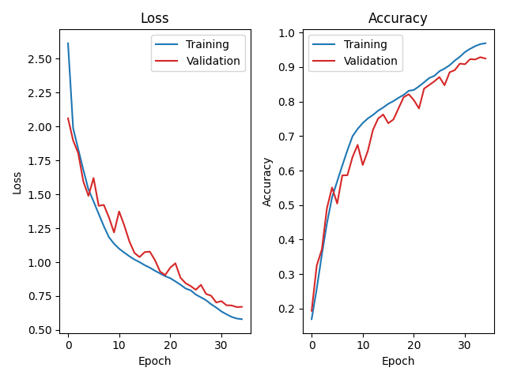
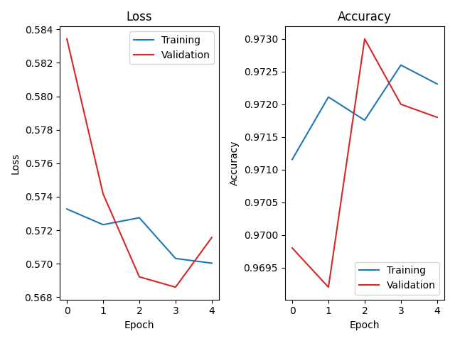

# Lab 3 Report Template

## 1. Model Architecture (10%)

* Describe how the `forward()` method and the `fuse_model()` function were implemented. Explain the rationale behind your design choices, such as why certain layers were fused and how this contributes to efficient inference and quantization readiness.

### QuantizableBasicBlock

在 `forward()` 中，我實作了兩組 conv-bn-relu 的序列，然後使用 `FloatFunctional` 處理 skip connection：

```python
out = self.conv1(x)
out = self.bn1(out)
out = self.relu(out)

out = self.conv2(out)
out = self.bn2(out)

if self.downsample is not None:
    identity = self.downsample(x)

out = self.add_relu.add_relu(out, identity)
```

這裡使用 `add_relu.add_relu()` 而不是 `out + identity` 再 `relu()`，是因為作業說明提到標準的 `torch.add` 或 `+` 在 quantization 時不會自動與 ReLU fuse。使用 `FloatFunctional` 可以讓 add 和 relu fuse 成單一操作，避免中間多一次 quantize/dequantize 轉換。

在 `fuse_model()` 中，我根據 relu 的位置來決定 fusion 範圍：

```python
torch.ao.quantization.fuse_modules(self, [['conv1', 'bn1', 'relu']], inplace=True)
torch.ao.quantization.fuse_modules(self, [['conv2', 'bn2']], inplace=True)

if self.downsample:
    torch.ao.quantization.fuse_modules(self.downsample, [['0', '1']], inplace=True)
```

conv2 後面沒有 relu，因為 relu 在 skip connection 之後才執行，所以只 fuse conv2-bn2。

### QuantizableBottleneck

在 `forward()` 中，我依序實作了三組 conv-bn-relu，然後使用 `FloatFunctional` 處理 skip connection：

```python
out = self.conv1(x)
out = self.bn1(out)
out = self.relu1(out)

out = self.conv2(out)
out = self.bn2(out)
out = self.relu2(out)

out = self.conv3(out)
out = self.bn3(out)

if self.downsample is not None:
    identity = self.downsample(x)

out = self.skip_add_relu.add_relu(out, identity)
```

同樣使用 `FloatFunctional` 來 fuse skip connection 的 add 和 relu。

在 `fuse_model()` 中，我根據每組層後面有沒有 relu 來決定 fusion 範圍：

```python
torch.ao.quantization.fuse_modules(self, [['conv1', 'bn1', 'relu1']], inplace=True)
torch.ao.quantization.fuse_modules(self, [['conv2', 'bn2', 'relu2']], inplace=True)
torch.ao.quantization.fuse_modules(self, [['conv3', 'bn3']], inplace=True)

if self.downsample:
    torch.ao.quantization.fuse_modules(self.downsample, [['0', '1']], inplace=True)
```

conv3 後面沒有 relu，因為 relu 在 skip connection 之後才執行，所以只 fuse conv3-bn3。

### QuantizableResNet

在 `forward()` 中，我在輸入和輸出端加上 quantization 的 stub：

```python
x = self.quant(x)      # Quantize input
# ... (conv1, bn1, relu, layers, avgpool, fc)
x = self.dequant(x)    # Dequantize output
```

這兩個 stub 在 FP32 training 時作為 identity，但 quantization 後會處理 float 和 int8 的轉換。

在 `fuse_model()` 中，我 fuse 了初始的 conv-bn-relu，然後遍歷所有 block：

```python
torch.ao.quantization.fuse_modules(self, [['conv1', 'bn1', 'relu']], inplace=True)

for m in self.modules():
    if type(m) is QuantizableBottleneck or type(m) is QuantizableBasicBlock:
        m.fuse_model()
```

這樣 fusion 的好處是 BN 參數可以併入 conv 的 weight 和 bias，減少 inference 運算。更重要的是 quantization 時，fuse 後的層只需要一組 scale 和 zero-point，避免每層都要做 quantize/dequantize 轉換，降低了 quantization error 累積，也提升了硬體執行效率。

## 2. Training and Validation Curves (10%)

* Provide plots of **training vs. validation loss** and **training vs. validation accuracy** for your best baseline model.
* Discuss whether overfitting occurs, and justify your observation with evidence from the curves.

下圖展示了 FP32 baseline model 在 35 個 epochs 的 training 過程中，training 和 validation 的 loss 與 accuracy 變化：



從圖中可以觀察到幾個重要的現象：

在 loss 曲線方面，training loss 和 validation loss 在前 20 個 epochs 都呈現穩定下降的趨勢，兩條曲線走向相當接近。然而在 20 epoch 之後，training loss 持續下降至約 0.6，但 validation loss 則趨於平穩，維持在約 0.7 左右。這個分歧現象顯示模型開始出現輕微的 overfitting。

在 accuracy 曲線方面，training accuracy 在後期持續攀升至接近 95%，而 validation accuracy 則在約 92-93% 之間震盪。兩者之間約 2-3% 的差距進一步證實了 overfitting 的存在。

整體而言，模型確實有 overfitting 的現象，但程度相對輕微且可接受。training 和 validation 曲線在前期仍保持同步，分歧主要出現在後期 training 階段。考慮到最終 validation accuracy 達到 92.81%，這樣的 overfitting 程度在實務上是合理的 trade-off。

## 3. Accuracy Tuning and Hyperparameter Selection (20%)

- **Data Preprocessing:** What augmentation or normalization techniques were applied? How did they impact model generalization?
- **Hyperparameters:** List the chosen hyperparameters (learning rate, optimizer, scheduler, batch size, weight decay/momentum, etc.) and explain why they were selected.
- **Ablation Study (Optional, +10% of this report):** Compare different hyperparameter settings systematically. Provide quantitative results showing how each parameter affects performance.

### Data Preprocessing

在 training data 方面，我使用了基礎的 data augmentation：
- RandomCrop(32, padding=4)
- RandomHorizontalFlip()

對於 validation 和 test data，則只使用基礎的 normalization，不做任何 augmentation：

```python
eval_transform = transforms.Compose([
    transforms.ToTensor(),
    transforms.Normalize((0.4914, 0.4822, 0.4465), (0.2023, 0.1994, 0.2010))
])
```

以下是不同 data augmentation 組合的實驗比較：

| Epochs | Data Augmentation | Validation Accuracy | Test Accuracy |
|:------:|:------------------|:-------------------:|:-------------:|
| 20 | Basic | 88.90% | 88.82% |
| 40 | Basic | - | 91.90% |
| 35 | Basic + ColorJitter | 92.81% | - |

從實驗結果可以看出，在相近的 training epochs 下（35 vs 40），加入 ColorJitter 後的 validation accuracy (92.81%) 明顯優於沒有 ColorJitter 的 test accuracy (91.90%)。不過 epochs 數量也可能有影響，這部分會在下方 hyperparameters 選擇中進一步說明。

所以為了更好的 accuracy，我加入了 ColorJitter：

```diff
train_transform = transforms.Compose([
    transforms.RandomCrop(32, padding=4),
    transforms.RandomHorizontalFlip(),
+   transforms.ColorJitter(brightness=0.2, contrast=0.2),
    transforms.ToTensor(),
    transforms.Normalize((0.4914, 0.4822, 0.4465), (0.2023, 0.1994, 0.2010))
])
```

### Hyperparameters and Comparison

| Hyperparameter | Loss Function | Optimizer | Scheduler | Weight Decay / Momentum | Epochs | Final Accuracy |
| -------------- | ------------- | --------- | --------- | ----------------------- | ------ | -------------- |
| Value          | CrossEntropyLoss (label_smoothing=0.1) | SGD | CosineAnnealingLR | weight_decay=5e-4 / momentum=0.9 | 35 | 92.81% |

**Loss Function**: 原先僅使用 CrossEntropyLoss，但發現 model 在 training set 上表現良好卻在 validation set 上效果不佳，顯示有 overfitting 的問題。為了改善這個狀況，我加入了 label smoothing (0.1)，將 hard target 轉換為 soft target，讓 model 在學習時不會對單一類別過於極端，從而提升 generalization 能力。實驗結果證實這個調整有效改善了 baseline accuracy。

**Optimizer**: 選擇 SGD with momentum (0.9) 和 weight decay (5e-4)。Momentum 幫助加速收斂並減少震盪，weight decay 提供 L2 regularization 防止 overfitting。

**Learning Rate Scheduler**: 使用 CosineAnnealingLR，讓 learning rate 以 cosine curve 的方式從初始值逐漸降到 0，在 training 後期提供更細緻的參數調整。

**Initial Learning Rate 與 Epochs 選擇**: 我選擇了 lr=0.1 和 35 epochs 的組合。從上方 data preprocessing 的實驗比較可以看出，增加 training epochs 從 20 提升到 40 可以改善 accuracy，但同時也增加了 training time。最終選擇 35 epochs，在 training time 和 accuracy 之間取得良好平衡。

**Batch Size**: 使用助教提供程式碼的預設值 64。

## 4. Custom QConfig Implementation (25%)

Detail how your customized quantization configuration is designed and implemented:

1. **Scale and Zero-Point:** Explain the mathematical formulation for calculating scale and zero-point in uniform quantization.
2. **CustomQConfig Approximation:** Describe how the `scale_approximate()` function in `CusQuantObserver` is implemented. Why is it useful?
3. **Overflow Considerations:** Discuss whether overflow can occur when implementing `scale_approximate()` and how to prevent or mitigate it.

### 1. Scale and Zero-Point

在我的 symmetric quantization 實作中，scale 的計算公式為：

$$s = \frac{2 \times \max(|r_{\min}|, |r_{\max}|)}{255}$$

這裡使用固定的 8-bit quantization range 255，而非動態計算的 `quant_max - quant_min`。這樣的設計確保了在不同 dtype（`torch.quint8` vs `torch.qint8`）下的行為一致性。

Zero-point 的設定則根據 dtype 有所不同：

$$z = \begin{cases}
128 & \text{if dtype = torch.quint8} \\
0 & \text{if dtype = torch.qint8}
\end{cases}$$

對於 `torch.quint8`（範圍 [0, 255]），zero-point 設為 128 以實現 symmetric quantization；而 `torch.qint8`（範圍 [-128, 127]）則直接以 0 為中心。

實作程式碼如下：

```python
if self.qscheme == torch.per_tensor_symmetric:
    scale = (2 * max_val) / 255  # Fixed 8-bit range
    zero_point = 128 if self.dtype == torch.quint8 else 0
```

### 2. CustomQConfig Approximation:

`scale_approximate()` 目標是將 scale 近似為 2 的次方，讓硬體可以用 bit shift 操作取代浮點數乘法。一開始我採用的做法是將 scale 四捨五入到最接近的 $2^n$：

```python
rounded_log2 = round(log2_scale)
```

但這樣的精度不夠細緻，會造成相對較大的 quantization error。後來我改用 quarter precision，將 scale 四捨五入到 $2^{n/4}$：

```python
log2_scale = math.log2(scale)
rounded_log2 = round(log2_scale * 4) / 4  # Quarter precision: 2^(n/4)
rounded_log2 = max(-max_shift_amount, min(max_shift_amount, rounded_log2))
return 2 ** rounded_log2
```

這個改動的好處是在保持硬體友善性的前提下，也就是仍然是 2 的次方，但是有更細緻的 quantization。
實驗結果證實這個調整很有效，將 quantization 造成的 accuracy drop 從約 2% 降到 < 1%。

### 3. Overflow Considerations

在實作 `scale_approximate()` 時，需要考慮可能導致 overflow 的情況並採取相應的防範措施：

1. input 檢查：當 `scale <= 0` 時，`math.log2(scale)` 會產生 domain error。在函數開頭加入檢查來避免此問題：

    ```python
    if scale <= 0:
        return scale
    ```

2. 指數範圍限制：若 scale 極大或極小，可能導致 `2 ** rounded_log2` overflow 或 underflow。實作中將 `rounded_log2` 限制在合理範圍內：

    ```python
    rounded_log2 = max(-max_shift_amount, min(max_shift_amount, rounded_log2))
    ```

    預設的 `max_shift_amount=8` 確保回傳值落在 $[2^{-8}, 2^8] = [0.0039, 256]$ 的範圍。

## 5. Comparison of Quantization Schemes (25%)

| Model | Size (MB) | Accuracy (%) | Accuracy Drop (%) |
|:-----:|:---------:|:------------:|:-----------------:|
| FP32  |   94.41   |    92.81     |         -         |
| PTQ   |   23.66   |    92.53     |       0.28        |
| QAT   |   23.66   |    92.39     |       0.42        |

從表格可以看出，PTQ 和 QAT 都達到了約 4 倍的 model compression，從 94.41 MB 降到 23.66 MB。這是因為 INT8 quantization 將每個參數從 32-bit float 降到 8-bit integer，理論 compression ratio 為 4 倍，實際結果與理論相符。

在 accuracy 方面，PTQ 下降了 0.28%，而 QAT 下降了 0.42%。兩種方法都成功維持在相當高的 accuracy，accuracy drop 皆小於 1%。

## 6. Discussion and Conclusion (10%)

- Did QAT outperform PTQ as expected?
- What challenges did you face in training or quantization, and how did you address them?
- Any feedbacks for Lab3 Quantization?

### QAT vs PTQ Performance

理論上，QAT 因為在 training 過程中 simulate quantization behavior，能讓 model parameters 更適應 quantization 後的數值範圍，應該會比 PTQ 有更好的 accuracy。然而在這次實驗中，QAT 並沒有如預期地優於 PTQ。

在我的實作中，QAT 使用了 5 個 epochs、learning rate 0.0001 進行 fine-tuning。下圖展示了 QAT fine-tuning 過程中的 loss 和 accuracy 變化：



從圖中可以觀察到，QAT 在 fine-tuning 過程中，validation loss 穩定下降，validation accuracy 則維持在 97% 以上的高水準。這顯示 QAT 成功地讓 model 適應了 quantization 的數值範圍。

然而雖然兩者都達成了 accuracy drop < 1% 的目標，但從結果來看，PTQ 在不需要額外 training 的情況下，反而獲得了更好的 accuracy。整體而言，custom quantization observer 的設計對兩種方法都有顯著的幫助，成功將 quantization 造成的 precision loss 控制在非常小的範圍內。

### Challenges faced in quantization

在實作自定義 quantization observer (`CusQuantObserver`) 時，我最初使用了以下公式來計算 symmetric quantization 的 scale：

```python
scale = max_val / (self.quant_max - self.quant_min) * 2
```

這個看似合理的公式卻導致 PTQ 和 QAT 的 accuracy 發生災難性的下降：
- **PTQ INT8 Accuracy**: 17.42%（相比 FP32 的 88.82%）
- **QAT INT8 Accuracy**: 18.76%（相比 FP32 的 88.82%）

經過仔細檢查與調整後，我發現問題出在兩個關鍵地方：

**問題 1：使用動態計算的 quantization range**

原始實作使用 `self.quant_max - self.quant_min` 來計算 quantization range，但這個值在不同 dtype（`torch.quint8` vs `torch.qint8`）下行為不一致。正確的做法是使用固定的 8-bit quantization range 255。

**問題 2：Zero-point 設定錯誤**

對於 symmetric quantization with torch.quint8，zero-point 應該設定為 128（範圍 [0, 255] 的中點），而非 0。這確保了 symmetric quantization 的正確實作。

修正後，PTQ 和 QAT 的 accuracy 都獲得了顯著改善，從原本接近隨機猜測的 17-18% 提升到接近 FP32 baseline 的水準。

```python
if self.qscheme == torch.per_tensor_symmetric:
    # Use fixed 8-bit range (0-255) instead of dynamic quant_max - quant_min
    scale = (2 * max_val) / 255
    # Set zero-point based on dtype
    zero_point = 128 if self.dtype == torch.quint8 else 0
```

接著為了進一步降低 quantization error，我調整 `scale_approximate()` 的實作：

```diff
def scale_approximate(self, scale: float, max_shift_amount=8) -> float:
    if scale <= 0:
        return scale
    log2_scale = math.log2(scale)
-   rounded_log2 = round(log2_scale)
+   rounded_log2 = round(log2_scale * 4) / 4
    rounded_log2 = max(-max_shift_amount, min(max_shift_amount, rounded_log2))
    return 2 ** rounded_log2
```

將 scale 從四捨五入到 2 的整數次方（$2^n$）改為四捨五入到 2 的 1/4 次方（$2^{n/4}$），即 $\text{rounded_log2} = \frac{\text{round}(\log_2(\text{scale}) \times 4)}{4}$。這個改動在保持硬體效率的前提下，提供了更細緻的 quantization precision，將 quantization 造成的 accuracy drop 從約 2% 降低到 < 1%。
