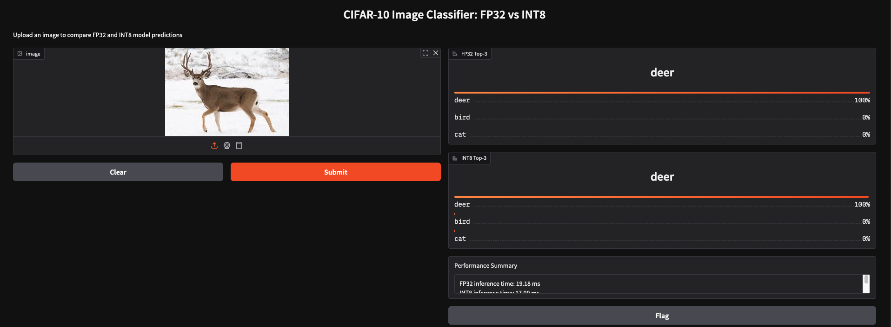
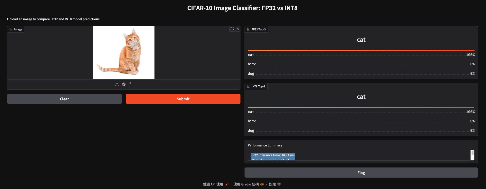
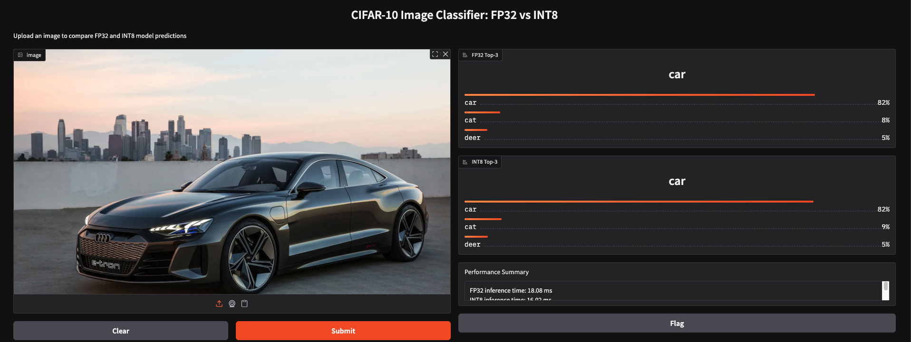
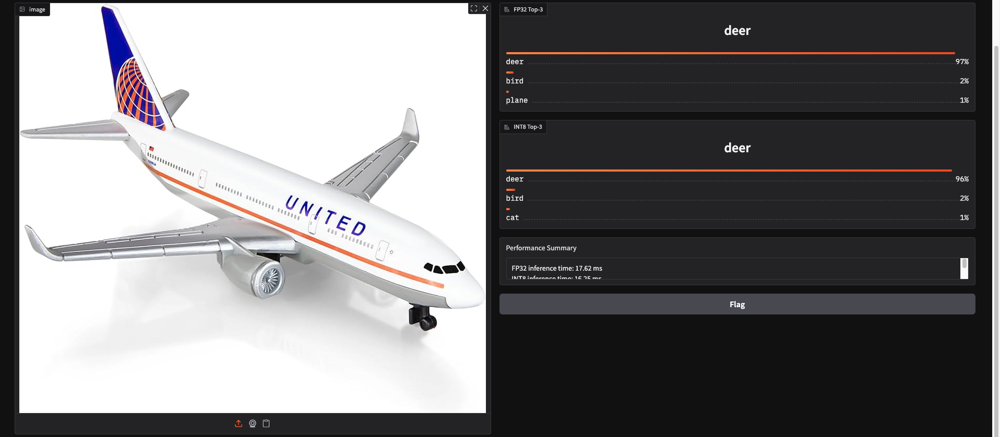
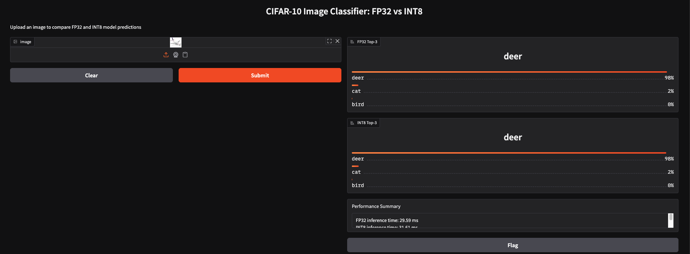
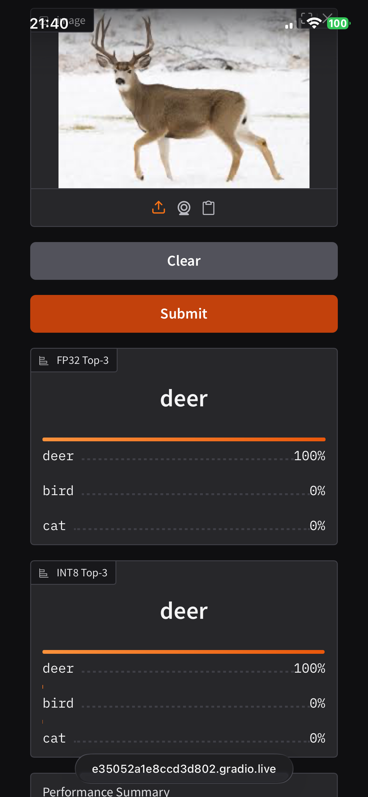
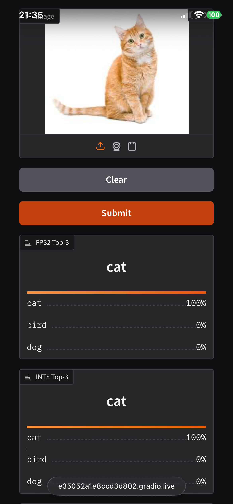
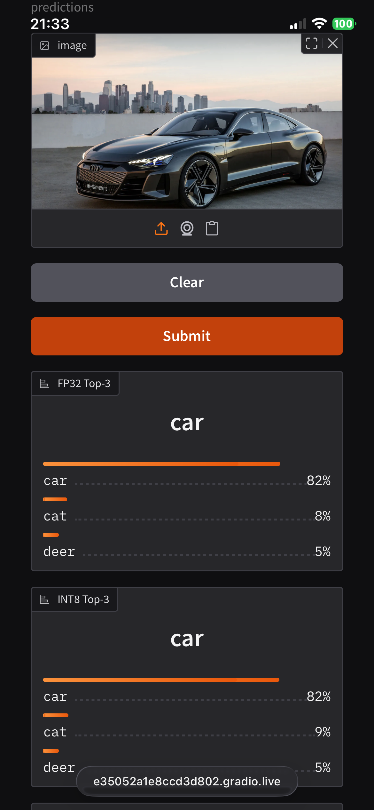
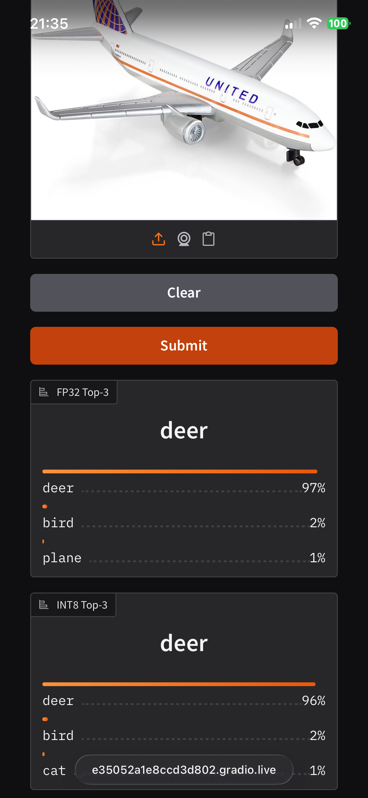
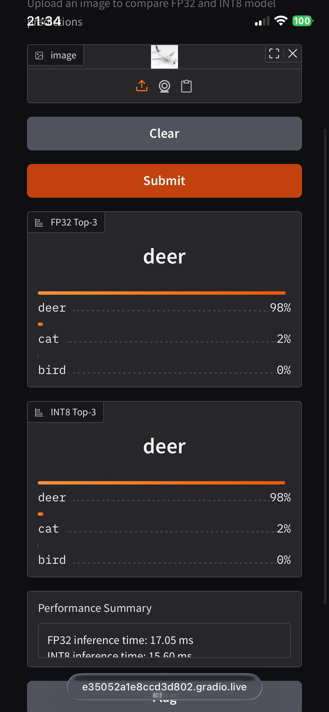

# EAI LABs Reports - Lab5

## Testing on Public Gradio Interface (10%)

### On Macbook

**Deer**



```
FP32 inference time: 19.18 ms
INT8 inference time: 17.09 ms
Speedup (FP32/INT8): 1.12×
```

**Cat**



```
FP32 inference time: 18.24 ms
INT8 inference time: 16.74 ms
Speedup (FP32/INT8): 1.09×
```

**Car**



```
FP32 inference time: 18.08 ms
INT8 inference time: 16.02 ms
Speedup (FP32/INT8): 1.13×
```

**Plane**



```
FP32 inference time: 16.88 ms
INT8 inference time: 16.26 ms
Speedup (FP32/INT8): 1.04×
```

**Plane (Resized)**



```
FP32 inference time: 29.59 ms
INT8 inference time: 31.61 ms
Speedup (FP32/INT8): 0.94×
```


### On iPhone

**Deer**



```
FP32 inference time: 29.62 ms
INT8 inference time: 27.47 ms
Speedup (FP32/INT8): 1.08×
```

**Cat**



```
FP32 inference time: 17.53 ms
INT8 inference time: 17.12 ms
Speedup (FP32/INT8): 1.02×
```

**Car**



```
FP32 inference time: 19.33 ms
INT8 inference time: 17.39 ms
Speedup (FP32/INT8): 1.11×
```

**Plane**



```
FP32 inference time: 17.61 ms
INT8 inference time: 16.29 ms
Speedup (FP32/INT8): 1.08×
```

**Plane (Resized)**



```
FP32 inference time: 17.05 ms
INT8 inference time: 15.60 ms
Speedup (FP32/INT8): 1.09×
```

### Analysis of Inference Results

在測試過程中觀察到圖片類型和 preprocessing 對 prediction results 的影響。使用真實照片進行測試時，deer 和 cat 的圖片即使保持原始解析度不經縮放，predictions 仍然正確。相對地，car 和部分 plane 圖片在不同解析度下表現不一。

測試初期使用了 32x32 的 icon 圖示作為輸入，三張 plane icon 的 predictions 全部錯誤，分別被預測為 cat 和 frog。這些 icon 雖然符合 model input 的尺寸要求，但預測失敗。後續改用真實照片後，deer, cat, car 三個類別都獲得正確的 predictions，而 plane 類別則出現部分成功、部分失敗的情況。

最終採用的測試圖片包含 deer, cat, car, plane 四個類別的真實照片。從 performance summary 可以看到，FP32 和 INT8 模型在每個測試案例上產生的 top-3 predictions 完全一致，顯示 quantization 沒有改變模型的 classification behavior。

## Difference between FP32 and INT8 (10%)

### Implementation Design

在 Gradio interface 的 implementation 中，核心函數是 `compare_fp32_int8`，負責同時執行 FP32 和 INT8 模型的 inference 並比較結果：

```python
def compare_fp32_int8(image: Image.Image):
    if image is None:
        return {}, {}, "Please Upload Your Image。"
    if sess_fp32 is None:
        return {}, {}, (_fp32_err or "The FP32 model has not been provided, so a comparison cannot be made.")

    x = preprocess(image)

    t0 = time.time()
    logits_fp32 = sess_fp32.run([out_fp32], {in_fp32: x})[0]
    fp32_ms = (time.time() - t0) * 1000

    t0 = time.time()
    logits_int8 = sess_int8.run([out_int8], {in_int8: x})[0]
    int8_ms = (time.time() - t0) * 1000

    p_fp32 = softmax_np(logits_fp32[0])
    p_int8 = softmax_np(logits_int8[0])

    def top3_map(p):
        idx = np.argpartition(p, -3)[-3:]
        idx = idx[np.argsort(p[idx])[::-1]]
        return {LABELS[i]: float(p[i]) for i in idx}

    top3_fp32 = top3_map(p_fp32)
    top3_int8 = top3_map(p_int8)

    summary = (
        f"FP32 inference time: {fp32_ms:.2f} ms\n"
        f"INT8 inference time: {int8_ms:.2f} ms\n"
        f"Speedup (FP32/INT8): {(fp32_ms / max(int8_ms, 1e-9)):.2f}×"
    )
    return top3_fp32, top3_int8, summary
```

函數首先對輸入圖片執行 `preprocess`，將 PIL Image 轉換為 32×32 的 normalized tensor。接著分別執行兩個模型的 inference，使用 `time.time()` 測量各自的 execution time 並轉換為毫秒單位。

執行完成後，將兩個模型的 logits 輸出經過 `softmax_np` 轉換為 probability distribution，然後使用 `top3_map` 提取機率最高的三個類別。這個 nested function 使用 `np.argpartition` 找出前三大值的 index，再用 `argsort` 排序，最後轉換為 dictionary 格式。

最終函數回傳三個值：FP32 的 top-3 predictions、INT8 的 top-3 predictions，以及包含兩個模型 inference time 與 speedup 比較的 summary text。這個設計讓 Gradio interface 能同時顯示 accuracy 與 performance 的差異。

### Performance Comparison and Observations

Macbook 平台測試結果：

| Image           | FP32 (ms) | INT8 (ms) | Speedup |
|-----------------|-----------|-----------|---------|
| Deer            | 19.18     | 17.09     | 1.12×   |
| Cat             | 18.24     | 16.74     | 1.09×   |
| Car             | 18.08     | 16.02     | 1.13×   |
| Plane           | 16.88     | 16.26     | 1.04×   |
| Plane (Resized) | 29.59     | 31.61     | 0.94×   |

iPhone 平台測試結果：

| Image           | FP32 (ms) | INT8 (ms) | Speedup |
|-----------------|-----------|-----------|---------|
| Deer            | 29.62     | 27.47     | 1.08×   |
| Cat             | 17.53     | 17.12     | 1.02×   |
| Car             | 19.33     | 17.39     | 1.11×   |
| Plane           | 17.61     | 16.29     | 1.08×   |
| Plane (Resized) | 17.05     | 15.60     | 1.09×   |

從測試數據觀察到 INT8 quantization 在大多數案例中提升了 inference speed。Macbook 上的 speedup 範圍為 1.04× 到 1.13×（排除異常值），iPhone 上則為 1.02× 到 1.11×。Macbook 上的 plane resized 案例出現 0.94× 的結果，INT8 反而比 FP32 慢。

兩個平台的 speedup pattern 相近，但 absolute inference time 有明顯差異。FP32 和 INT8 模型在所有測試案例上產生完全相同的 top-3 predictions，顯示 quantization 保持了模型的 classification capability。

## Reflections and Suggestions for This Lab (5%)

本次 Lab 成功展示了從 PyTorch model 到 web deployment 的完整流程，涵蓋 ONNX conversion、INT8 quantization 以及 Gradio interface 的建置。相較於 Lab3 和 Lab4 著重於特定技術的深入探討，Lab5 更注重實際 deployment 的整合應用，讓我們了解如何將訓練好的 model 部署為可用的 web service。

在實作過程中，感覺有幾點可以進一步加強。首先，測試圖片的選擇標準感覺其實不太準確？。講義中有提到「圖片要盡量找跟 model input 大小相近的」，但實際測試發現圖片類型（真實照片 vs 圖示）對 prediction accuracy 的影響更為關鍵。若能提供 CIFAR-10 test set 的 subset 作為 benchmark，或是明確說明適合的圖片特徵，感覺會更有方向？

然後 Gradio public link 的運作機制值得在講義中補充說明。Public link 會在 Colab session 結束時失效，初次使用時可能需要一些時間理解這個行為。若能在講義中加入 troubleshooting section，說明如何重新啟動 server 或使用 local deployment，會更有幫助。

接著在 quantization 的部分感覺有點摸不著頭緒。我通過實驗觀察到 speedup 範圍為 1.02× 到 1.13×，對於 ResNet18 這樣的輕量級 model 而言，quantization 帶來的效益相對有限。可能要說明一下 quantization 在本次 Lab 中想要學生實作的方向或是意義。
